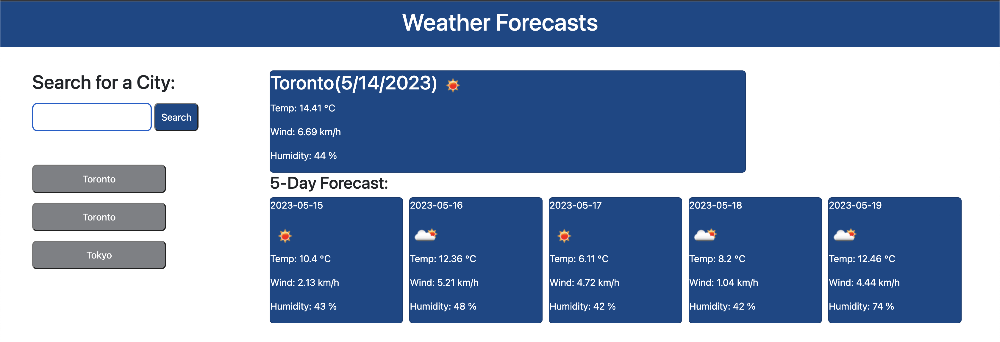

# weather-forecasts

## Description
- Use the 5 Day Weather Forecast API to retrieve weather data for cities.

- Create form inputs about search for a city

- Display city name, current date, an icon representation of weather conditions, the temperature, the humidity, and the wind speed

- Display for 5 day forecast that the date, an icon representation of weather conditions, the temperature, the wind speed, and the humidity

- Add the search history to local storage to display

- When I click on a city in the search history,presented with current and future conditions for that city

## Github page
- https://shok1to.github.io/weather-forecasts

## Repository
- https://github.com/Shok1to/weather-forecasts

## Credits
- Weather API:https://openweathermap.org/forecast5
- Bootstrap:https://getbootstrap.com/

